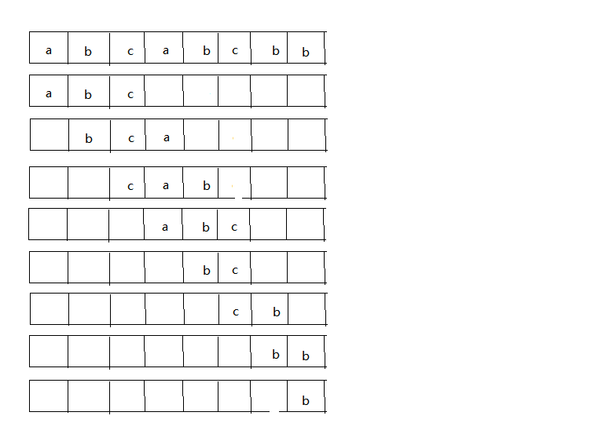
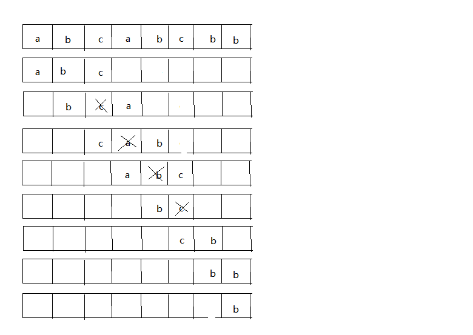
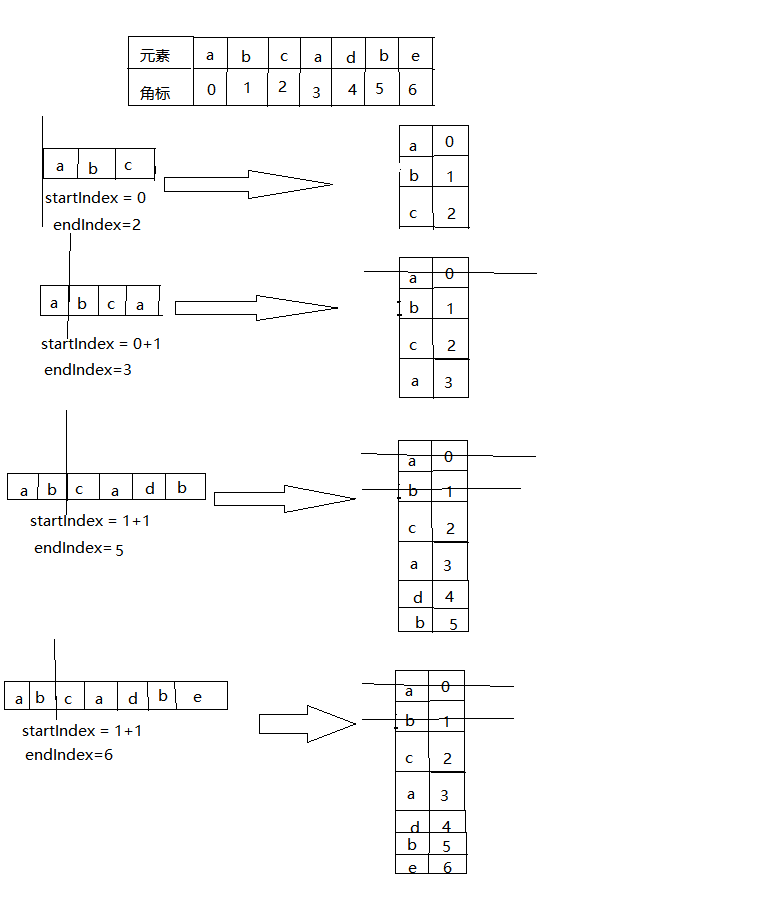

# 无重复字符的最长子串
## 描述
```$xslt
给定一个字符串，请你找出其中不含有重复字符的 最长子串 的长度。
示例 1:
输入: "abcabcbb"
输出: 3 
解释: 因为无重复字符的最长子串是 "abc"，所以其长度为 3。
示例 2:
输入: "bbbbb"
输出: 1
解释: 因为无重复字符的最长子串是 "b"，所以其长度为 1。
示例 3:
输入: "pwwkew"
输出: 3
解释: 因为无重复字符的最长子串是 "wke"，所以其长度为 3。
     请注意，你的答案必须是 子串 的长度，"pwke" 是一个子序列，不是子串。
```
## 思路 1 
    1.声明一个临时字符串变量，用于存放子字符串
    2.从字符串的第1个字符开始，判断子字符串里是否包含当前字符，如果不包含就在子字符串后面追加这个字符，
    如果包含，说明子字符串里已经有该字符，此时结束当前的循环。然后从下个位置的字符串开始继续查找。
    假设目标字符串为abcabcbb：
        a-> ab ->abc ->abca (通过比较发现a字符重复，所以结束当前循环，子字符串为abc,长度为3
        b->bc ->bca->bcab(通过比较发现b字符重复，所以结束当前循环，子字符串为bca,长度为3)
        c->ca ->cab->cabc(通过比较发现c字符重复，所以结束当前循环，子字符串为cab,长度为3)
        a->ab ->abc->abcb(通过比较发现b字符重复，所以结束当前循环，子字符串为abc,长度为3)
        .
        .
        .
        b->bb((通过比较发现b字符重复，所以结束当前循环，子字符串为b,长度为1))
***
<div align="center">
    
</div>

 ```
 public int lengthOfLongestSubstring(String s) {
        if (null == s) {
            return 0;
        }
        if (s.length() == 0 || s.length() == 1) {
            return s.length();
        }
        int maxLength = 0;
        for (int i = 0; i < s.length(); i++) {
            String substring = s.substring(i, i + 1);
            for (int j = i + 1; j < s.length(); j++) {
                String next = s.substring(j, j + 1);
                if (substring.indexOf(next) != -1) {
                    break;
                }
                substring += next;
            }
            maxLength = Math.max(substring.length(),maxLength);
        }
        return maxLength;
    }
```
## 思路 2
    1.通过执行思路1的方法后，我们发现代码里有很多不必要的计算
    2.在abcabcbb中，从a开始查找后发现最长的字符串为abc，此时已经明确了abc里没有重复的字符串
    3.然后在以b开始查找的时候就可以跳过对c字符的判断，只需要判断c后面的abcbb即可，最终得到字符串为bca
    4.然后以c开始查找的时候同样可以跳过对a字符的判断。如下图所示：
***
   <div align="center">
    
</div>

***
	5.在循环中判断的条件是：已经比较过的不重复的字符，不需要再次进行比较，只要记住最后结束的字符的角标index，然后
	在下一次比较的时候直接和该字符的下一个元素[index+1]的比较就可以了。

```
public int lengthOfLongestSubstring(String s) {
       if (null == s) {
            return 0;
        }
        if (s.length() == 0 || s.length() == 1) {
            return s.length();
        }
        int maxLength = 0;
        int lastIndex = -1;
        for (int i = 0; i < s.length(); i++) {
            int j = (lastIndex > 0 && lastIndex > i) ? lastIndex + 1 : i + 1;
            String substring = s.substring(i, j);
            while (j < s.length()) {
                String next = s.substring(j, j + 1);
                if (substring.indexOf(next) != -1) {
                    break;
                }
                lastIndex = j;
                substring += next;
                j++;
            }
            maxLength = Math.max(maxLength,substring.length());
        }
        return maxLength;
    }
```
## 思路 3
    1.对于字符串 pwwkew 直观上一眼就看出它的最长不重复子字符串是wke,并且长度是3
    2.如果我们能够知道这个字符串的起始角标位置和最后的角标位置，是不是可以计算字符串的长度呢？
    3.比如在pwwkew里，最长不重复子串是：wke，其起始角标是2 ，最后的角标位置是4， 长度就是：4-2+1=3
    4.如果我们能够知道每个元素对应的角标，并且假设字符串里没有重复字符，比如字符串abcde,此时有
    startIndex = [0] , endIndex = s.length()-1
    5.如果只含有一个重复的元素，abcdbefgh , 这时候重复字符是b,可以得到两个不含有b的字符串，ab 和cdbefgh
    6.如果是含有多个重复的元素：
        a.首先维护一个Map<Character,Integer>用来存储字符串里每个字符的角标，startIndex代表不重复的字符串的开始位置，
        初始值是0
        b.如果当前元素在Map里没有，就将当前的元素的角标放入Map里
        c.如果当前元素已存在Map里，说明当前字符是重复的元素，此时可以得到不重复的字符串[0,index1-1],假设当前字符位置是
        index1
        d.然后从Map里获取的重复的元素的位置i,从i的下一个位置开始再次查找[startIndex,s.length()-1]，此时startIndex = i+1
        e.如果在index2位置查找到重复的元素，并且Map里存储的重复元素位置包含在[startIndex,s.length()-1]里面
        此时得到不重复字符串[startIndex,index2-1]
        f.以此类推，重复上述判断操作，直到循环结束。
        
***
<div align="center">
    
</div>

```
  public int lengthOfLongestSubstring(String s) {
         if (null == s) {
             return 0;
         }
         if (s.length() == 0 || s.length() == 1) {
             return s.length();
         }
         Map<Character, Integer> map = new HashMap<Character, Integer>();
         int startIndex = 0;
         int maxLength = 0;
         for (int i = 0; i < s.length(); i++) {
             char mkey = s.charAt(i);
             int mindex = map.containsKey(mkey)?map.get(mkey):-1;
             if(mindex < 0 || startIndex > mindex){
                 map.put(mkey,i);
                 maxLength = Math.max(maxLength, i - startIndex + 1);
                 continue;
             }
             startIndex = mindex+1;
            map.put(mkey,i);
         }
         return maxLength;
     }
```
## 思路 3
    1.利用滑动窗口算法